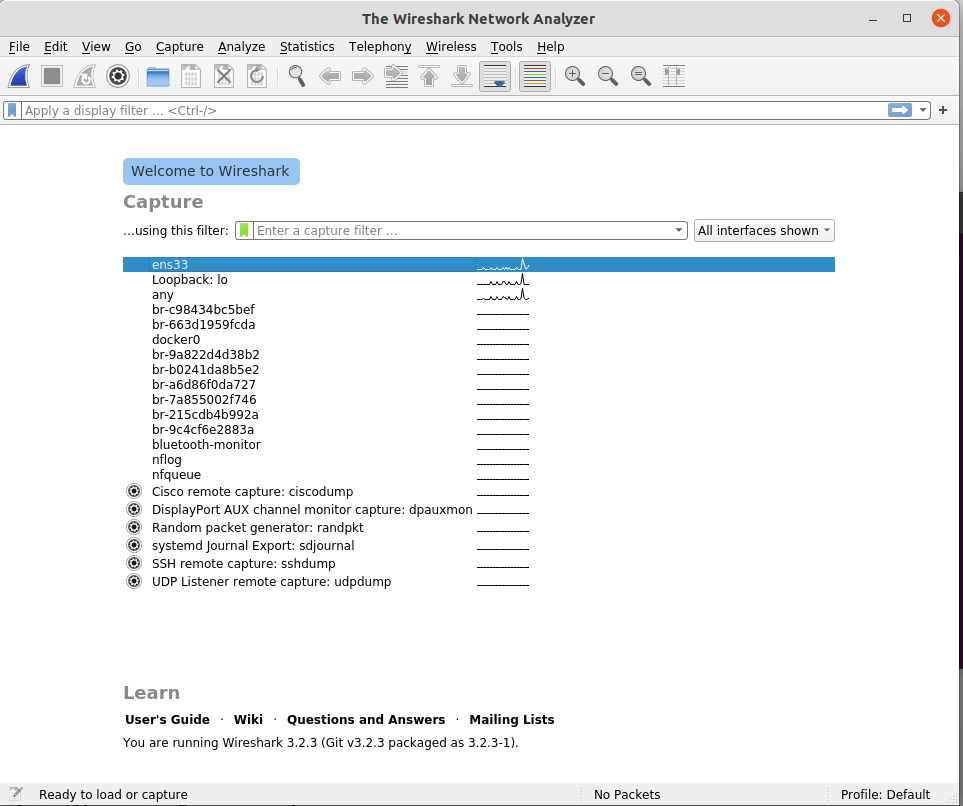

#wireshark介绍

* wireshark的官方下载网站： http://www.wireshark.org/
* wireshark是非常流行的网络封包分析软件，功能十分强大。可以截取各种网络封包，显示网络封包的详细信息。
* wireshark是开源软件，可以放心使用。 可以运行在Windows和Mac OS上。
* 使用wireshark的人必须了解网络协议，否则就看不懂wireshark了。
  #Wireshark不能做的
* 为了安全考虑，wireshark只能查看封包，而不能修改封包的内容，或者发送封包。
  #wireshark 开始抓包
  
  wireshark是捕获机器上的某一块网卡的网络包，当你的机器上有多块网卡的时候，你需要选择一个网卡。
  #Wireshark 窗口介绍
  
  WireShark 主要分为这几个界面

1. Display Filter(显示过滤器)，  用于过滤
2. Packet List Pane(封包列表)， 显示捕获到的封包， 有源地址和目标地址，端口号。 颜色不同，代表
3. Packet Details Pane(封包详细信息), 显示封包中的字段
4. Dissector Pane(16进制数据)
5. Miscellanous(地址栏，杂项)

#Wireshark 显示过滤

使用过滤是非常重要的， 初学者使用wireshark时，将会得到大量的冗余信息，在几千甚至几万条记录中，以至于很难找到自己需要的部分。搞得晕头转向。

过滤器会帮助我们在大量的数据中迅速找到我们需要的信息。

过滤器有两种，

一种是显示过滤器，就是主界面上那个，用来在捕获的记录中找到所需要的记录

一种是捕获过滤器，用来过滤捕获的封包，以免捕获太多的记录。 在Capture -> Capture Filters 中设置

#过滤表达式的规则

1. 协议过滤

   比如TCP，只显示TCP协议。
2. IP 过滤

   比如 ip.src ==192.168.1.102 显示源地址为192.168.1.102，

   ip.dst==192.168.1.102, 目标地址为192.168.1.102
3. 端口过滤

   tcp.port ==80,  端口为80的

   tcp.srcport == 80,  只显示TCP协议的愿端口为80的。
4. Http模式过滤

   http.request.method=="GET",   只显示HTTP GET方法的。
5. 逻辑运算符为 AND/ OR

#封包列表(Packet List Pane)
封包列表的面板中显示，编号，时间戳，源地址，目标地址，协议，长度，以及封包信息。 你可以看到不同的协议用了不同的颜色显示。
你也可以修改这些显示颜色的规则，  View ->Coloring Rules.


#封包详细信息 (Packet Details Pane)
这个面板是我们最重要的，用来查看协议中的每一个字段。

各行信息分别为

* Frame:   物理层的数据帧概况
* Ethernet II: 数据链路层以太网帧头部信息（MAC）
* Internet Protocol Version 4: 互联网层IP包头部信息（IP协议）
* Transmission Control Protocol:  传输层T的数据段头部信息，此处是TCP（TCP/UDP协议）
* Hypertext Transfer Protocol:  应用层的信息，此处是HTTP协议

#wireshark与对应的OSI七层模型


#TCP包的具体内容
从下图可以看到wireshark捕获到的TCP包中的每个字段。


#实例分析TCP三次握手过程
看到这， 基本上对wireshak有了初步了解， 现在我们看一个TCP三次握手的实例

三次握手过程为


开启一个http服务作演示

```go
python3 -m http.server 8001
```

第一次握手数据包

客户端发送一个TCP，标志位为SYN，序列号为0， 代表客户端请求建立连接。 如下图

第二次握手的数据包

服务器发回确认包, 标志位为 SYN,ACK. 将确认序号(Acknowledgement Number)设置为客户的I S N加1以.即0+1=1, 如下图

第三次握手的数据包

客户端再次发送确认包(ACK) SYN标志位为0,ACK标志位为1.并且把服务器发来ACK的序号字段+1,放在确定字段中发送给对方.并且在数据段放写ISN的+1, 如下图:


#syn 无状态扫描

   https://github.com/XinRoom/go-portScan
