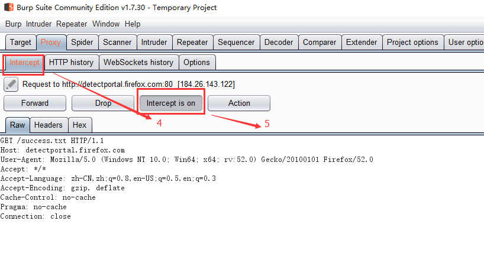
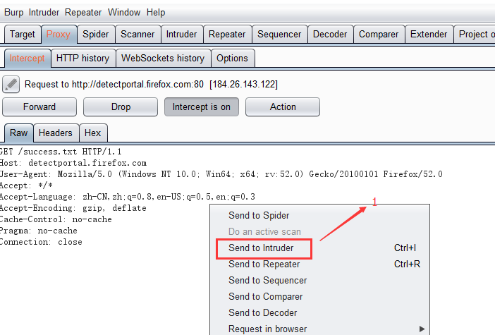
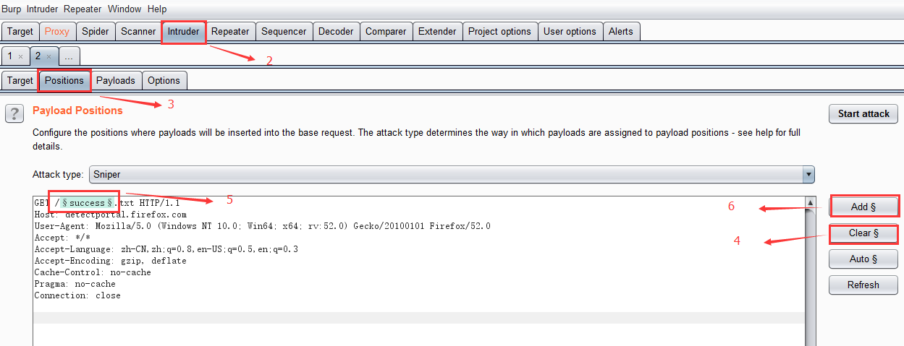
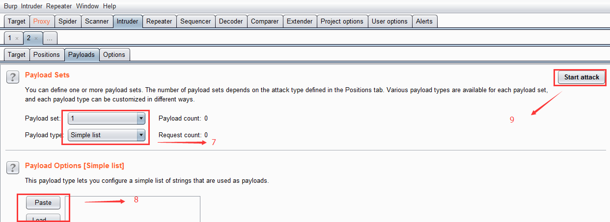
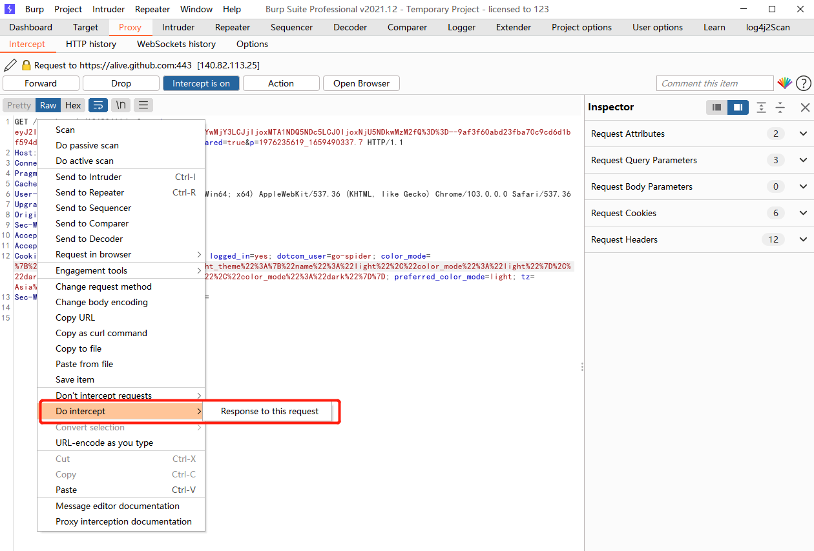

## BurpSuite 介绍

Burp Suite 是一款强大的 Web 渗透测试套件，主要功能包括代理截获、网页爬虫、Web 漏洞扫描、定制化爆破等，结合 Burp 的插件系统，还可以进行更加丰富多样的漏洞发掘。

可以从[官网](https://portswigger.net/burp)获取到社区版的 Burp，社区版的 Burp 有一些功能限制，但是可以通过其他渠道获取到专业版。Burp 使用 Java 语言编程，可以跨平台运行。

## 安装

在官网上选择适合自己版本的 Burp，官网提供多平台的安装包，在保证系统拥有 Java 环境的基础上，推荐直接下载 Jar file 文件。

下载完成后双击 burpsuite_community_v1.x.xx.jar 即可运行，其他安装方式遵循相关指示安装即可。

## 快速入门

### proxy

Burp 使用的第一步是实现浏览器到 Burp 的代理，以 Firefox 为例

选择 *选项* ——> *高级* ——> *网络* ——> *连接 设置* ——>配置代理到本机的未占用端口(默认使用 8080 端口)

在 Burp 的 proxy 下的 options 中查看代理监听是否开启，默认监听 127.0.0.1:8080

在 Firefox 的代理状态下，访问 HTTP 协议的网页即可在Burp中截获交互的报文，可以使用Firefox插件-Toggle Proxy来快速切换代理模式。

### HTTPS 下的 proxy（老版本 Burp ）

新版 Burp（1.7.30）已经不需要单独导入证书即可抓包，而老版 Burp Https 协议需要浏览器导入 Burp 证书才可正常抓包，具体操作见参考文档。




### intruder

intruder 常用于口令爆破，当然作为支持批量可编程的网页重发器，它还有许多有趣的玩法。

使用步骤：

1. 在 proxy 页面拦截口令登录请求包
2. 在 http 报文显示栏点击右键，选择 “Send to Intruder”
3. 进入 intruder 选项栏，选择子选项栏 Positions，点击右边栏的 “Clear” 清空智能识别的占位符
4. 重新选中需要爆破的部分，点击右边栏的 “Add” 添加新的占位符
5. 选择子选项栏 “Payloads”，添加爆破口令模式以及爆破文件
6. 在子选项栏 “Options” 中可以添加更加复杂的爆破结果匹配模式
7. 选择完成后，点击右上角的 “Start attack” 开始爆破







### repeater

repeater 用于单一报文的重复发包测试，在 proxy 界面报文包只能发送一次，通过右键 “Send to Repeater” 可以在 repeater 界面反复发包测试。
###修改返回内容
右键Do intercept -- Response to this request


####中文显示乱码
User options -Display - HTTP Message Display - Change font… 选择一个中文的字体格式，调整显示字体大小

User options -Display - Character Sets,选择 UTF-8 编码
####自动替换数据包中的内容
Proxy - Options - Match and Replace - Add
```go
<title>(.*?)</title>
```

####证书错误解决
    cert.is_expired="true"
    chrome://net-internals/#hsts 
    thisisunsafe
    控制台：sendCommand(SecurityInterstitialCommandId.CMD_PROCEED)


