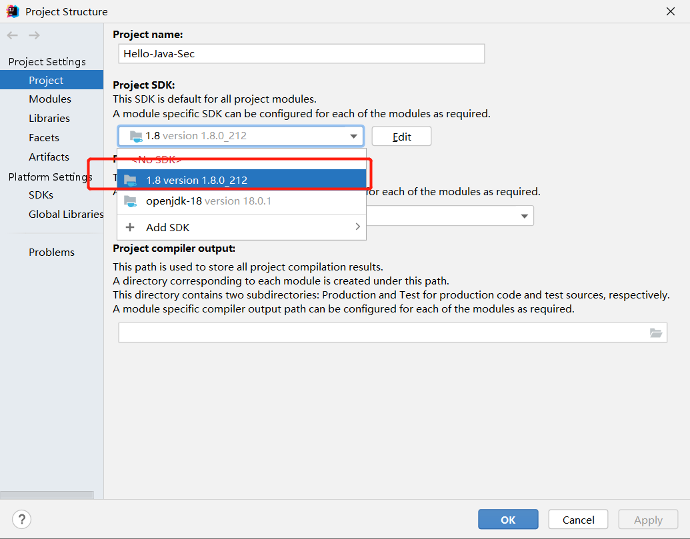

https://github.com/j3ers3/Hello-Java-Sec

#启动项目

```java
<groupId>org.cyclonedx</groupId>
    <artifactId>cyclonedx-maven-plugin</artifactId>
<version>2.5.3</version>
```
```java
management.health.ldap.enabled=false
```