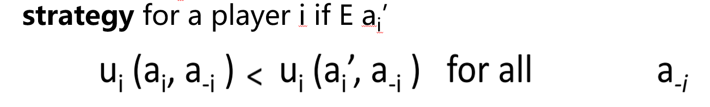
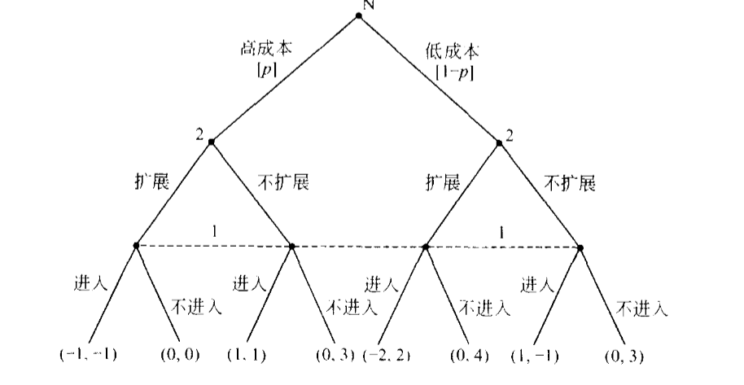
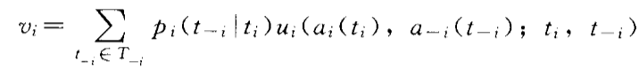
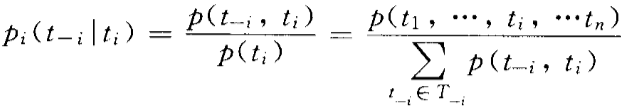
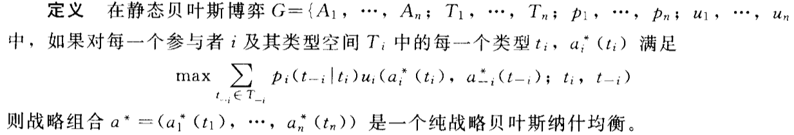

## 第一章

#### 博弈论例子

* 囚徒博弈：选择（沉默，沉默）是一个有效结局，但这并不是博弈解，最终都会选择（坦白，坦白）
* 军备竞赛
* 海滩占位：单位长度为1，本来一个在1/4，一个在3/4（理想解），现在甲为了多卖点就想往中间靠，乙考虑到甲会这样做，他也往中间靠，因此最后是大家都在中间（博弈解），参考现实中的xx一条街
* 智猪博弈

#### 基本概念

* 博弈论是研究多人谋略和决策问题的理论。

#### 博弈基本要素

* players（参与者）博弈的决策主体，除此之外，还有一个虚拟的参与者“自然”--不以意志转移的外生事件（房地产竞争）
* imformaition（信息）：参与者能了解到或观察到的知识，包括”自然“选择和其他参与者的特征和行动。
* **完全信息：每一个参与者对自己及其他参与者的行动，以及产生的收益等知识有完全的了解**。
* strategies（策略）：参与者的行动规则，通常用si表示，战略组合表示为s=(s1,s2,s3.......)
* 收益：特定战略组合下得到的效用或期望效用，参与者的收益不仅取决于自己的战略选择，而且取决于所有参与者的战略选择。
* 均衡：所有参与者的最优战略组合。

#### 分类

| 动态（参与者行动有先后顺序，后行动的能观察先行动的）                                                                                                                                                                                                 | 静态（同时行动，或无法观察对方的行动） |
| ---------------------------------------------------------------------------------------------------------------------------------------------------------------------------------------------------------------------------------------------------- | -------------------------------------- |
| 完全信息（完全信息指的是所有参与者各自选择的行动的不同组合所决定的 各参与者的收益对所有参与者来说是共同知识。简单通俗地说， 完全信息是指每一个参与者对自己以及其他参与者的行动，以及各参与者选择的行动组合产生的收益等知识有完全的了解。） | 不完全信息                             |

## 第二章 完全信息静态博弈

#### 博弈标准表达式

* 参与者集合i∈T={1,2,3......n}
* 每个参与者战略空间 Si
* 参与者收益（效用）函数 ui(s1,s2,s3.....sn)

#### 严格占优战略均衡

* 经济学对理性的描述：在约束条件下追求效用最大化。
* 不论其他参与者选择什么战略，该参与者有唯一一个最优战略（所获得的效用最大），这个最优战略称为严格占优战略。
* 

##### 严格占优战略均衡

* 由所有参与者的严格占优战略构成的战略组合s*，例如囚徒博弈里的（坦白，坦白）。
* **只要参与者是理性的，他一定会选，并不需要把理性作为“共同知识”（我知道你知道我是理性）。**

#### 逐步剔除严格劣战略均衡

##### 严格劣战略

* 在对比的情况下某个战略的收益严格小于其他所有战略，对于理性的参与者会它剔除
* **需要把理性作为“共同知识”（我知道你知道我是理性）。**

##### 严格劣战略均衡

* 由上述剔除形成的均衡

##### 弱严格劣战略

* 在对比的情况下某个战略的收益**小于等于**其他所有战略，对于理性的参与者会它剔除

#### 纳什均衡

* 每个参与者根据其他参与者决策的期望，最优化自身效用的情形（不一定是效用最高，但一定不想再选其他，**每个人都这么想（海滩卖饮料的例子 ）**）。
* 对于每个参与者i，si是针对n-1个参与者所选战略的最优反应战略，即**ui(s1*,s2*,....,si*,.........)>=ui(s1*,s2*,....,si,.........)（NE）**，对所有战略组合均成立。
* 寻找纳什均衡（两个参与者）的简单方法：划线法
  * 对于给定的参与者1的战略，参与者2在收益高的战略下划线；同理参与者1，若存在一个格子里两个收益都被划线了，则为纳什均衡解。
* 严格占优战略均衡和严格剔除劣战略均衡一定是纳什均衡，反之不然。
* 纳什均衡不会被严格劣战略剔除，但有可能被弱劣战略剔除。
* 性别战博弈：在一起做不喜欢的事总比自己一个人做好，但是又不能两个人一起做喜欢的事。（在此例子中，纳什均衡始终不能使双方都满意）。

#### 纳什均衡的例子

##### 库诺特双寡头竞争模型

* 求均衡解法一

  * 求出u1和u2的表达式
  * 将大于等于问题转化为多元函数极值问题
  * 求偏导，令偏导等于0
* 法二（几何法）

  * 博弈最优函数画图求解
* 法三（逐步剔除严格劣战略）

  * 待看

##### 最后要价总裁模型

* 建模（正态分布）
* 数学方法求解均衡（一阶微分方程等于0，求极值）
* 结论：

##### 公地悲剧模型

* 个人有机会将优势集中于自身，副作用被三步到群体的其他人中。

#### 混合战略纳什均衡（猜硬币例子，纳税人和税收机关的例子）本质就是通过概率分布估计期望收益

* 参与者i的一个混合战略是在其战略空间Si中战略si的概率分布。
* 纯战略：剪刀/石头/布，（1/2，1/2，0）概率分布则为一个混合战略。
* 收益函数函数定义为对应战略的概率×收益并求和，p26。
* 所有以正概率进入最优混合战略的纯战略都是最优战略，期望收益在这些纯战略之间一定是无差异的。

#### 纳什定理的存在性

* 存在性定理1
* 存在性定理2
* 存在性定理3
* 对于博弈出现的纳什均衡，每个参与者都不都不会偏离它的愿望，但当出现多重纳什均衡时，会出现大家选的不是同一个纳什均衡的情况，这是一个难题。
  * 解决方法：聚集，帕累托最优，风险占优
  * 聚集：加入一些特性的信息以确定大家选同一个均衡
  * 帕累托最优：选择收益没那么大但风险较小的均衡。

### 第三章完全信息动态博弈

#### 博弈的扩展式表述

#### 博弈树（game tree）

* 由节和枝组成
  * 决策节（参与者i）和终点节（对应行动组合的收益）
  * 枝：对应节参与者i选择的行动

#### 信息集（判断决策结是否属于一个信息集，看他们知道的信息是不是一样的）

* 参与者的一个信息集是指满足一下条件的***决策结***的集合。
  1. 在此信息集中的每一个节轮到该参与者行动。
  2. 当博弈进行到信息集中的一个节时，应该行动的参与者并不知道到达了信息集中的哪一个节。
  3. 一个或多个，具体看是否知道上一步别人选什么。
  4. 一个决策节属于且只属于一个信息集。
  5. 同一信息集hi中所有决策结属于参与者i。
  6. 同一信息集中所有的决策结上都有相同的行动空间。
* **完美信息博弈**：***博弈树的所有信息集都是单结（与完全信息区分）***。

#### 动态博弈标准式的纳什均衡博弈扩展式与标准式的转换

* ***参与者i的纯战略空间Si=与每一个信息集对应的可行动集做笛卡尔积***
* 数量等于**∏**A（hi）（行动集所含元素个数连乘）。
* 所有参与者的一个纯战略组合确定了博弈树上的一条路径，并产生一个对应的收益（终结点处）。

#### 行为战略

* 定义在信息集的可行行动空间A(hi)上的**概率分布，其中每一种行为对应一个概率bij（i表示参与者i，j表示该信息集对应的可行行动空间中的行动j），如p50图3-11**。

##### 行为战略与混合战略的转换问题（概率计算）

* 对于参与者i的某个hi信息集中对应的行动战略ai计算为：
  * 找出可以到达该信息集的所有纯战略空间Sk（所在路径），并求和得到p1
  * 在上述Sk中，选择了行动ai的纯战略空间，并求和得到p2
  * 则bi( ai | hi )=p2/p1（1.0），即为包含该行动的纯战略空间的百分比
* 若上式（1.0）分母为0，则重新定义计算公式为：
* 行为战略向纯战略空间转换，则
  * 行为战略=包含该行为的纯战略空间之和
  * 解方程，***解不唯一***。
* 在完美记忆博弈中，混合战略和行为战略具有等价性。（完美记忆是指知道自己访问过的信息集（I）,记得自己的行动，完美回忆要求两点之间的路径唯一）

##### 逆向归纳法求解完全且完美信息博弈（两阶段）

* 通过先求第二阶段的最优解，逆向指导第一阶段的最优解。

##### 子博弈精炼纳什均衡

* 子博弈定义
  1. 始于单结信息集的决策结x，(但不包括原博的初始结)；
  2. 包含博弈树中决策结 x 的所有后续结 (包括终点结)；
  3. 没有对任何信息集形成**分割。****ket**
* 子博弈精炼纳什均衡
  * 扩展式表述博弈的战略组合 s*= (s1* ，·，si*，··，sn*)是一个子博奔精炼纳什均衡，条件是
  * s* 是原博弈的纳什均衡
  * s*在每一个子博弈上给出纳什均衡

##### 用逆向归纳法求解子博弈精炼纳什均衡

* 有限完美且完全信息博弈
  1. 从最下往上找子博弈
  2. 对每一个子博弈用逆向归纳进行求解
  3. 直到包含根结点
* 有限非完美信息博弈
  1. 从最下往上找子博弈，若遇到非单节点信息集，先越过分析，再回头考虑（或者把它当成静态博弈考虑）
  2. 对每一个子博弈用逆向归纳进行求解
  3. 直到包含根结点
* **任何完全信息动态有限博弈都存在子博弈精炼纳什均衡**

#### 重复博弈

### 不完全信息静态博弈（静态贝叶斯博弈）

* 不完全信息：至少有一个参与者不完全了解其他参与者的收益函数

##### 不完全信息下的库诺特模型

* 注意与完全信息区分

#### 不完全信息静态博弈的标准式

* 在博弈三要素的基础上引入**类型（掌握的信息不同）**和**推断**
* 类型：用ti表示参与者i的一个类型，例如t11，t12，表示参与者1有两个类型，在这两种类型下的收益函数不同
* 推断：用条件概率表示参与者在知道自己类型的情况下，推断别人类型的概率。

#### 海萨尼转换

* 将一个不完全信息博弈表述为一个完全但不完美信息的博弈（见第三章）
* 

#### 贝叶斯纳什均衡

* 通过类型空间和行动空间构建战略空间
* 战略Ai（ti），收益函数ui(a1(t1),...ai(ti),...,an(tn);ti)是所有参与者的共同知识。
* 所有参与者知道所有参与者知的战略空间和收益函数是如何依赖于各自的类型，不完全信息指的是，参与者j不知道参与者i的类型，因此不知道对应的收益。
* 根据推断生成期望收益函数
* 参与者i的推断表示为

##### 纳什均衡

* 使得上述收益函数取得最大的每一个参与者i的战略组合，则称为一个纯战略贝叶斯纳什均衡。
* 寻求不完全信息静态博弈纳什均衡，**相当于寻求有|Ti|个参与者的完全信息静态博弈的纳什均衡**。
