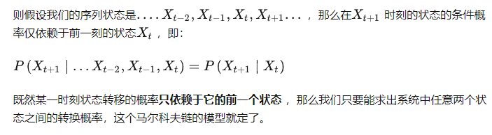

## 论文学习笔记

### 马尔可夫链

与贝叶斯网络的区别：马尔科夫链的状态是可以相互影响的，而贝叶斯网络则是单向的，一个节点只会影响下一个节点，但不会被它所影响。

#### 随机过程

简单来说，随机过程就是使用统计模型一些事物的过程进行预测和处理 ，比如股价预测通过今天股票的涨跌，却预测明天后天股票的涨跌；天气预报通过今天是否下雨，预测明天后天是否下雨。这些过程都是可以通过数学公式进行量化计算的。通过下雨、股票涨跌的概率，用公式就可以推导出来 N 天后的状况。

#### 马尔科夫链含义

马尔科夫链为状态空间中经过从一个状态到另一个状态的转换的`<u>`随机过程`</u>`，该过程要求具备“**无记忆性** ”，即下一状态的概率分布只能由当前状态决定，在时间序列中它前面的事件均与之无关。这种特定类型的“**无记忆性** ”称作马尔可夫性质。

马尔科夫链认为**过去所有的信息都被保存在了现在的状态下了** 。比如这样一串数列 1 - 2 - 3 - 4 - 5 - 6，在马尔科夫链看来，6 的状态只与 5 有关，与前面的其它过程无关。

#### 数学定义

#### 转移概率矩阵

通俗讲就是把状态转移的所有情况写成矩阵。如下例子：

上图中有 A 和 B 两个状态，A 到 A 的概率是 0.3，A 到 B 的概率是 0.7；B 到 B 的概率是 0.1，B 到 A 的概率是 0.9。

如果求 2 次运动后的状态概率分别是多少？初始状态和终止状态未知时怎么办呢？这是就要引入转移概率矩阵 ，可以非常直观的描述所有的概率。

有了状态矩阵，我们可以轻松得出以下结论：

* 初始状态 A，2 次运动后状态为 A 的概率是 0.72；
* 初始状态 A，2 次运动后状态为 B 的概率是 0.28；
* 初始状态 B，2 次运动后状态为 A 的概率是 0.36；
* 初始状态 B，2 次运动后状态为 B 的概率是 0.64；

有了概率矩阵，即便求运动 n 次后的各种概率，也能非常方便求出。

来看一个更复杂的情况：

**特性：**矩阵每行求和都为1.

#### 转移概率矩阵的稳定性（马尔可夫链的收敛性质）

