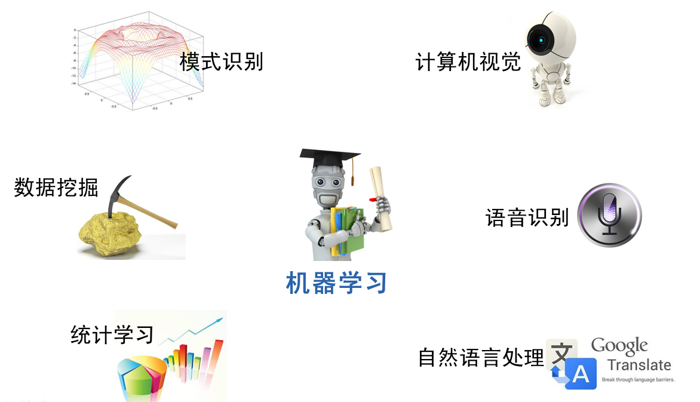
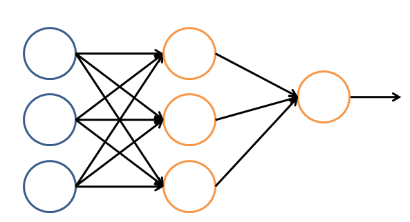

### 机器学习的例子：

* 等人问题：判断这次他会不会鸽，可以从之前的经验作为参考，心里设置一个**阈值70%**，之前一共跟他约了10次（频次**属性**），假设情况一是他之前迟到了3次，迟到占比30%，那么还没到我设定的阈值，这次他应该不会迟到；情况二是他之前迟到了8次，占比80%，已经超过了阈值，这次他应该也会迟到。
  * 若再增加一个自变量时间作为考量，假设他星期五迟到的概率特别大，那么，我们可以建立一个模型来模拟他是否会迟到，如图
    这就是最简单的决策模型。
* 如果把这些建立模型的过程交给电脑。比如把所有的自变量和因变量输入，然后让计算机帮我生成一个模型，同时让计算机根据我当前的情况，给出我是否需要迟出门，需要迟几分钟的建议。那么计算机执行这些辅助决策的过程就是机器学习的过程。
* 过程：首先，我们需要在计算机中存储历史的数据。接着，我们将这些 数据通过机器学习算法进行处理，这个过程在机器学习中叫做“训练”，处理的结果可以被我们用来对新的数据进行预测，这个结果一般称之为“模型”。对新数据 的预测过程在机器学习中叫做“预测”。“训练”与“预测”是机器学习的两个过程，“模型”则是过程的中间输出结果，**“训练”产生“模型”，“模型”指导 “预测”**。
* **它的处理过程不是因果的逻辑，而是通过归纳思想得出的相关性结论。**

## 机器学习的范围

* 模式识别=机器学习。两者的主要区别在于前者是从工业界发展起来的概念，后者则主要源自计算机学科。
* 数据挖掘=机器学习+数据库。
* 统计学习近似等于机器学习。
* 计算机视觉=图像处理+机器学习。图像处理技术用于将图像处理为适合进入机器学习模型中的输入，机器学习则负责从图像中识别出相关的模式。百度识图、手写字符识别、车牌识别
* 语音识别=语音处理+机器学习。语音助手
* 自然语言处理=文本处理+机器学习。例如词法分析，语法分析等等

## 机器学习的方法

* 回归算法：回归算法有两个重要的子类：即线性回归和逻辑回归。
  * 线性回归就是我们前面说过的房价求解问题。如何拟合出一条直线最佳匹配我所有的数据？逻辑回归预测结果是离散的分类，例如判断这封邮件是否是垃圾邮件，以及用户是否会点击此广告等等。
  * 逻辑回归只是对线性回归的计算结果加上了一个**Sigmoid**函数，将数值结果转化为了0到1之间的概率
* 神经网络（ANN）：让我们看一个简单的神经网络的逻辑架构。在这个网络中，分成**输入层，隐藏层，和输出层**。输入层负责接收信号，隐藏层负责对数据的分解与处理，最后的结果被整合到输出层。每层中的一个圆代表一个处理单元，可以认为是模拟了一个神经元，若干个处理单元组成了一个层，若干个层再组成了一个网络，也就是"神经网络"。如下图所示
* 支持向量机（SVM）：支持向量机算法从某种意义上来说是逻辑回归算法的强化：通过给予逻辑回归算法更严格的优化条件，支持向量机算法可以获得比逻辑回归更好的分类界线。
* 聚类算法（无监督算法）：聚类算法中最典型的代表就是K-Means算法。
* 降维算法（无监督算法）：其主要特征是将数据从高维降低到低维层次。例如，房价包含房子的长、宽、面积与房间数量四个特征，也就是维度为4维的数据。可以看出来，长与宽事实上与面积表示的信息重叠了，例如面积=长 × 宽。通过降维算法我们就可以去除冗余信息，将特征减少为面积与房间数量两个特征，即从4维的数据压缩到2维。降维算法的主要代表是PCA算法(即主成分分析算法)。
* 推荐算法（不属于监督或无监督）：是目前业界非常火的一种算法，在电商界，如亚马逊，天猫，京东等得到了广泛的运用。推荐算法的主要特征就是可以自动向用户推荐他们最感兴趣的东西，从而增加购买率，提升效益。推荐算法有两个主要的类别：
  * 一类是基于物品内容的推荐，是将与用户购买的内容近似的物品推荐给用户，这**样的前提是每个物品都得有若干个标签**，因此才可以找出与用户购买物品类似的物品，这样推荐的好处是关联程度较大，但是由于每个物品都需要贴标签，因此工作量较大。
  * 另一类是基于用户相似度的推荐，则是将与**目标用户兴趣相同的其他用户购买的东西推荐给目标用户**，例如小A历史上买了物品B和C，经过算法分析，发现另一个与小A近似的用户小D购买了物品E，于是将物品E推荐给小A。
  * 两类推荐都有各自的优缺点，在一般的电商应用中，一般是两类混合使用。推荐算法中最有名的算法就是**协同过滤算法**。
