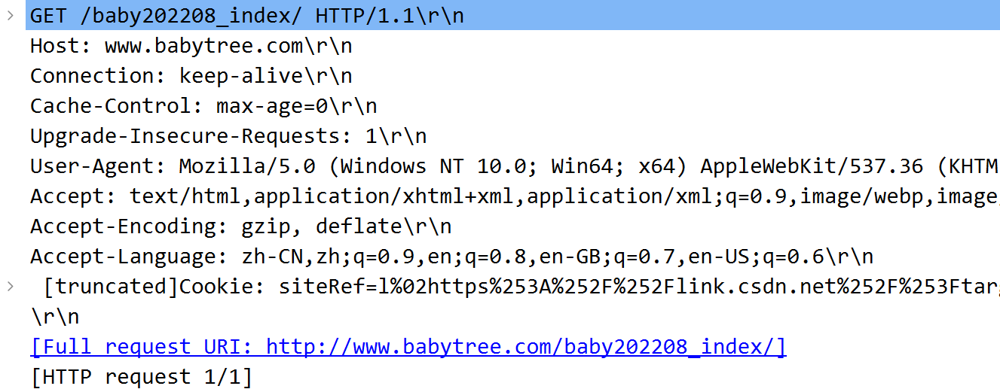
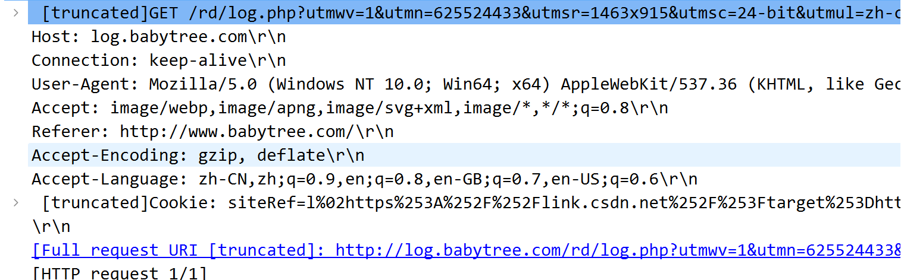
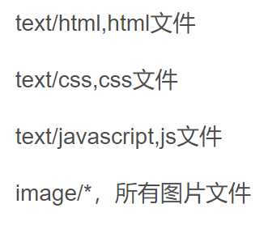
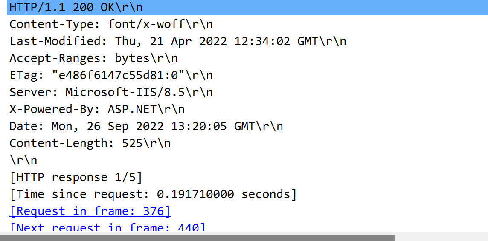

### http协议的作用及特点

* **HTTP**是一个客户端和服务器端请求和应答的**标准**（TCP）。
* 用户代理：通过使用Web浏览器、网络爬虫或者其它的工具，客户端发起一个到服务器上指定端口（默认端口为80）的HTTP请求。（我们称这个客户端）叫***用户代理***（user agent）。
* 源服务器：应答的服务器上存储着（一些）资源，比如HTML文件和图像。（我们称）这个应答服务器为源服务器（origin server）。
* 在用户代理和源服务器中间可能存在多个中间层，比如代理，网关，或者隧道（tunnels）。
* 过程：http客户端发送一个HTTP请求，建立一个到服务器指定端口（默认为80端口）的TCP连接；服务器一旦收到请求，就会发回一个状态行和（响应）信息，消息的消息体可能是请求的文件、错误消息、或者其它一些信息。

#### 特点

1. 它是基于**请求/响应**模型，有请求才有响应，必须成对。
2. HTTP协议的默认端口：**80**
3. 简单快速：客户向服务器请求服务时，只需传送***请求方法和路径***。请求方法常用的有**GET、HEAD、POST**。每种方法规定了客户与服务器联系的类型不同。由于HTTP协议简单，使得HTTP服务器的程序规模小，因而通信速度很快。
4. 灵活：想传什么类型的数据对象都可以，正在传输的类型由**Content-Type**加以标记
5. 无连接：限制每次只处理**一个**请求，处理完并确认客户端收到，就断开连接传输时间
6. 无状态：不会对消息进行状态标记，要是用到之前的信息，就必须重传

### 协议功能

* HTTP协议（HyperText Transfer Protocol，**超文本传输**协议）是用于从WWW服务器***传输超文本***到本地浏览器的传输协议。它可以使浏览器更加高效，使网络传输减少。它不仅保证计算机正确快速地传输超文本文档，还确定传输文档中的哪一部分，以及哪部分内容首先显示(如文本先于图形)等。
* URL：我们在浏览器的地址栏里输入的网站地址叫做URL (Uniform Resource Locator，[统一资源定位符](https://baike.baidu.com/item/%E7%BB%9F%E4%B8%80%E8%B5%84%E6%BA%90%E5%AE%9A%E4%BD%8D%E7%AC%A6))。当你在浏览器的地址框中输入一个URL或是单击一个[超级链接](https://baike.baidu.com/item/%E8%B6%85%E7%BA%A7%E9%93%BE%E6%8E%A5)时（这里涉及dns协议相关知识，即域名与ip地址直接的关系），URL就确定了要浏览的地址。浏览器通过超文本传输协议(HTTP)，将Web服务器上站点的网页代码提取出来，并编译成漂亮的网页。

### HTTP协议的组成

* 当输入某个网址访问某个网站（淘宝）时，浏览器会向服务器端（淘宝的web服务器）发送一个HTTP请求，请求后后会组织响应数据封装成一个http响应返回给浏览器。
* **HTTP请求包括:请求行、请求头、请求体；http响应包括:响应行、响应头、响应体**

### HTTP请求报文

HTTP请求报文右3部分组成（请求行+请求头+请求体）：

* 其中第一行是请求行：**请求方式 资源路径 协议/版本**
* **get请求**：将请求参数追加在url后面（如上图中的baby_index），**不安全**；url长度限制get请求方式数据的大小；没有请求体；一般的HTTP请求大多都是GET
* post请求：请求参数在请求体处，较安全。请求数据大小没有显示；只有表单设置为method="post"才是post请求，其都是get请求
* 常见get请求:地址栏直接访问、`<a href="">`、``等

#### 请求头

* 从第二行开始，到第一个空格结束（如上图的因为使用了get请求方法，因此第二行到最后都是请求头部分）
* 请求头通常以键值对的形式传递数据

#### 常见的请求头

* **Referer**：表示这个请求是从哪个url跳过来的,通过百度来搜索淘宝网,那么在进入淘宝网的请求报文中,Referer的值就是:www.baidu.com。如果是直接访问就不会有这个头。，如上图中，来自babytree跳过来的。
* **Accept**：告诉服务端,该请求所能支持的响应数据类型,专业术语称为MIME 类型(文件类型的一种描述方式)。通用结构为：type/subtype[;参数]，如上图中为image（什么文件类型）/apng（存储格式）等。例如

* **cookie**：客户端的Cookie就是通过这个报文头属性传给服务端的哦
* **User-Agent**：浏览器通知服务器，客户端浏览器与操作系统相关信息
* **Connection:表示客户端与服务连接类型；Keep-Alive表示持久连接，close已关闭**
* **Content-Type:请求的与实体对应的MIME信息。如果是post请求,会有这个头,默认值为application/x-www-form-urlencoded，表示请求体内容使用url编码**
* **Accept-Encoding：浏览器通知服务器，浏览器支持的数据压缩格式。如GZIP压缩**
* **Accept-Language：浏览器通知服务器，浏览器支持的语言。各国语言(国际化i18n)**
* **Cache-Control：指定请求和响应遵循的缓存机制**,对缓存进行控制，如一个请求希望响应返回的内容在客户端要被缓存一年，或不希望被缓存就可以通过这个报文头达到目的。

### HTTP响应报文（响应行+响应头+响应体）

#### 响应行（蓝色部分，与请求行类似）

1. 报文协议及版本
2. 状态码及状态描述

##### 状态码：**由3位数字组成，第一个数字定义了响应的类别**

* 1xx：指示信息，表示请求已接收，继续处理
* 2xx：成功，表示请求已被成功接受，处理
  * 200 OK：客户端请求成功
  * 204 No Content：无内容。服务器成功处理，但未返回内容。一般用在只是客户端向服务器发送信息，而服务器不用向客户端返回什么信息的情况。不会刷新页面。
  * 206 Partial Content：服务器已经完成了部分GET请求（客户端进行了范围请求）。响应报文中包含Content-Range指定范围的实体内容
