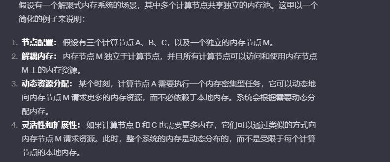

# ROLEX: A Scalable RDMA-oriented Learned Key-Value Store for Disaggregated Memory Systems

## 阅读（初读）

### 这篇文章属于什么领域或方向？

数据存储和检索

keyword：RDMA（是一种计算机网络技术，允许一台计算机直接访问另一台计算机的内存空间，而无需经过中央处理单元（CPU）的干预https://zhuanlan.zhihu.com/p/340361876）、

### 解决了什么问题？为什么这个问题这么重要？

现有的有序 KV 无法在分解的内存系统上很好地工作，因为要么消耗多个网络往返来搜索远程数据，要么严重依赖配备不足计算资源的内存节点来处理数据修改。效率太低无法发挥上述分解内存系统的优势。

### 使用了什么方法和模型？为什么这个方法可以解决这个问题？

方法：提出了一种具有学习索引的可扩展的面向 RDMA 的 KV 存储，称为 ROLEX，以合并分类系统中的有序 KV 存储，以实现高效的数据存储和检索。

ROLEX将插入和重新训练（***到底是训练什么呢***）操作解耦（为什么解耦就可以解决上述问题），使得计算节点能够直接修改远程数据，而无需重新训练模型，其他计算节点通过具有一致性保证（什么是一致性保证）的旧模型（过时了怎么还能用）来识别新修改的数据。

### 核心结论是什么？下一步还可以怎么做？

本文提出了 ROLEX，一种可扩展的面向 RDMA 的有序键值存储，使用分解内存系统的学习索引。
