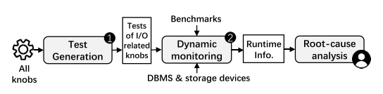
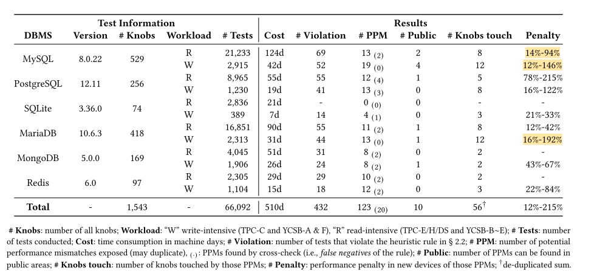
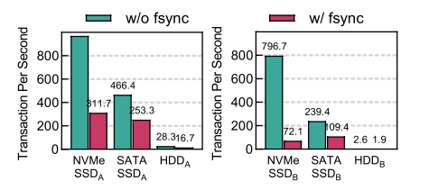
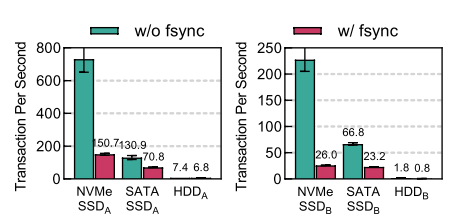

# When Database Meets New Storage Devices: Understanding and Exposing Performance Mismatches via Configurations

## 阅读（初读）

### 这篇文章属于什么领域或方向？

数据库与nvms

### 解决了什么问题？为什么这个问题这么重要？

问题：现有的数据库管理系统可能无法发挥出新存储设备应有的性能（**高性能存储设备往往提供低于预期的性能**），但没有解决；（这个问题好像没有那么重要）

### 使用了什么方法和模型？为什么这个方法可以解决这个问题？

*实验设计*：控制变量是设备（nvme，SSD，HDD），在同一个DBMS上测试效果

*测试平台*：

* MySQL, PostgreSQL，SQL- ite, MariaDB, MongoDB and Redis
* YCSB and TPC

*测试方法*：

生成工作负载，仅调整与io相关的knobs，通过分析运行结果得到原因。

*测试过程*：

* I/O相关旋钮确定
  * I/O相关的系统调用
  * 将旋钮连接到I/O相关的系统调用
  * 数据流连接
  * 控制流连接
* 生成旋钮的值
* 修建搜索空间
* 测试原则：***启发式规则：旋钮机制（优化）->高层的设备比底层的设备表现更不好（相对值）->性能不匹配（核心逻辑链发现性能不匹配）***
* 确定根本原因：跟踪I/O路径，先假设几个可能的因素，再比较。

本质上是控制变量法，作者假定了几种可能的参数配置，然后发现这些改变这些参数配置（互为对照）可以发现新存储设备的性能下降比正常的多很多，

### 核心结论是什么？下一步还可以怎么做？

在本文中，我们发现，硬塞新的存储设备到现有的DBMS可能会导致性能不匹配，这可能会对性能产生严重影响。性能不匹配很少被研究和/或检测。为了填补这一空白，我们对性能不匹配进行了全面的研究，以了解其症状，根本原因和触发条件。在这项研究中，我们提出了一种方法，利用配置来检测性能不匹配。我们发现，性能不匹配可以分为三种类型的基础上，他们的根本原因，我们进行了深入的分析的根本原因模式。与基线方法相比，我们的方法是更有效的，可以检测更多的性能失配。

## 实验结果

exp:如果在更改旋钮后，HDD中的查询延迟降低到1.3倍，而NVMe SSD中的延迟降低到2.6倍，则此不匹配的性能损失为100% · 2.6/1.3 = 200%

### 三大原因

#### Size in write

DBMS发出的强制写入请求太小，导致SSD的写缓存工作效率低下。

#### Parallelism in write and read

DBMS发出的I/O请求几乎都是序列化的，这导致新设备的内部并行性在很大程度上被浪费。

#### 读写顺序

DBMS通常会消耗大量的资源（CPU，内存）将随机I/O转换为顺序I/O;而在NVMe SSD中，两种类型的I/O之间的速度差距很小，这使得转换效率较低甚至浪费。

## 疑问

### 如何发现性能不匹配，标准是什么，这个标准是否可靠

没有标准，作者定义了一种启发式规则（类似找不同）。

### 性能不匹配产生的影响是什么，这个影响是否重要

可能会导致nvmes等设备性能发挥不到预期效果，但还是比传统设备要好，所以好像没有不好的影响（性能过剩）

### 检测方法是否合理，是否考虑全面

个人认为实验设计比较合理，考虑的因素很全面。

### 对性能不匹配的定义

nvmes和sata的基数本来就比HDD大，这个差值会不会是硬件原因而被放大了而不是配置的原因？

## 总结

现有的DBMS没法发挥出新存储设备的最佳性能，并通过改变DBMS参数配置得出了三大根本原因。

个人认为本文的亮点在于实验设计，虽然只从DBMS的参数配置方面考虑，但对照实验做的很完备，说服力很强，其次是工作量比较大。然而即使现有的DBMS没法发挥出新存储设备的最佳性能，还是比HDD等传统设备吞吐量等性能都提升巨大（只是和自己比稍差），DBMS开发者真的有动力去完善这些配置吗？让**现有**DBMS适应新设备和开发**新DBMS**适应新设备个人更倾向后者。
