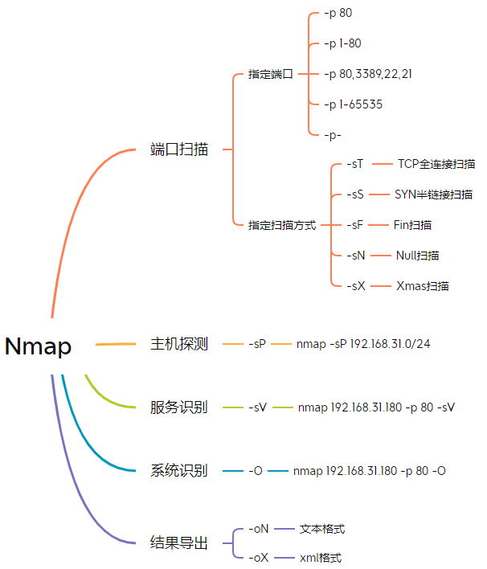
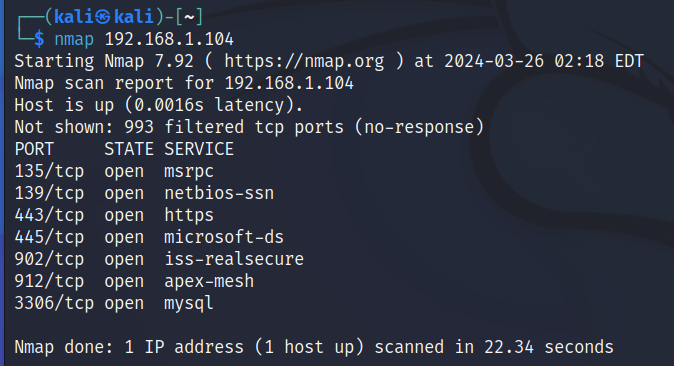
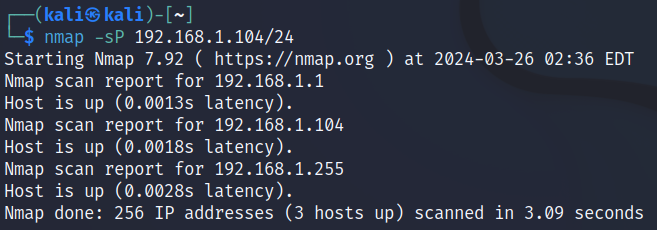
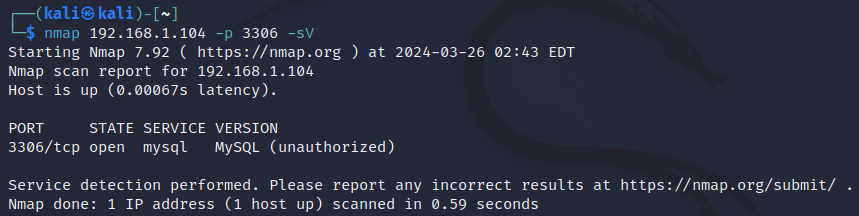
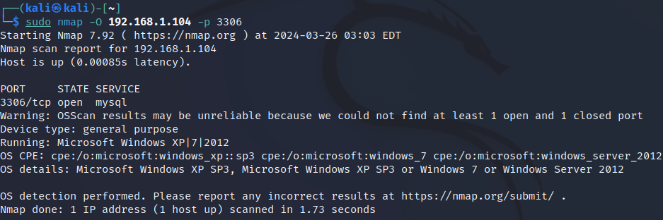

### nmap使用

命令使用：namp [可选功能如端口、扫描方式、主机、服务等] IP(可单个可多个) [-p 指定端口]

#### 端口扫描 nmap ip [可选功能]

1.`nmap 192.168.1.104` (默认扫描1000个端口)

用22.34秒扫描了1000个端口，其中991个端口关闭，结果中列出的9个端口就是开放的端口。

2.`nmap 192.168.1.104 -p 3306` (扫描**指定端口**)

##### 指定扫描方式

`1. nmap `-sT ` 192.168.1.104 -p 80`

使用 `-sT` 参数进行**TCP全连接扫描**，「全连接扫描」使用完整的三次握手建立链接，能够建立链接就判定端口开放，否则判定端口关闭。

2.` nmap `-sS `192.168.1.104 -p 80`

使用 `-sS` 参数进行**SYN半链接扫描**。「半链接扫描」只进行两次握手，对方返回确认帧（ACK=1）就判定端口开放，否则判定端口关闭。

#### 主机扫描（存活）

本质是ping扫描，ping通就有回包，就代表主机在线

nmap -sP IP/24

`nmap -sP 192.168.1.104/24`

扫描这个网段下存活的主机，发现只有路由器在线（1）广播地址（255）

#### 服务(version)识别 

扫描某个端口对应的服务，但不显示服务版本。

`nmap `-sV `192.168.1.104 -p 80 `

#### 扫描操作系统

`nmap -O 192.168.1.104` [可选端口]

### Burpsuite使用

Burp Suite 是一款广受欢迎的网络安全和渗透测试工具，它由PortSwigger Web Security开发。这个工具主要被用来测试Web应用程序的安全性。它包含多种功能和工具，能够帮助安全研究人员发现并利用Web应用程序中的漏洞。Burp Suite的常用功能包括：

1. **拦截代理（Proxy）**：允许用户拦截、查看和修改从浏览器到服务器的HTTP/HTTPS请求和响应。这是Burp Suite中最基本且最常用的功能之一，对于理解应用程序如何处理数据非常有帮助。
2. **扫描器（Scanner）**：自动化的漏洞扫描工具，用于发现Web应用程序中的安全漏洞。这包括SQL注入、跨站脚本（XSS）、文件路径遍历等常见漏洞。
3. **爬虫（Spider）**：用于自动映射Web应用程序的内容和结构。通过爬虫，可以发现隐藏的资源、目录、页面等，为渗透测试和漏洞评估提供基础。
4. **重放器（Repeater）**：允许用户修改并重发HTTP请求，无需重新通过浏览器发送。这对于测试应用程序对特定请求的响应非常有用。
5. **入侵者（Intruder）**：强大的自动化攻击工具，可用于执行模糊测试和定制化攻击。用户可以设置一系列的攻击参数，入侵者将自动发送请求并记录响应，帮助识别潜在的漏洞。
6. **比较器（Comparer）**：用于比较两个请求或响应的不同之处。这在确定某项更改如何影响应用程序行为时非常有用。
7. **解码器（Decoder）**：工具用于解码和编码各种数据格式，如URL编码、HTML实体、Base64编码等。
8. **序列化攻击工具（Sequencer）**：用于测试应用程序会话令牌或其他重要数据值的随机性和可预测性。

这些功能使Burp Suite成为网络安全专业人员和渗透测试人员的重要工具，帮助他们识别和利用Web应用程序中的安全漏洞。

#### 初步使用

1. 利用burp拦截相应的流量，在target中可以看到相应的信息
2. 关闭拦截流量功能，新建一个scan，可以在右边看到相应信息
