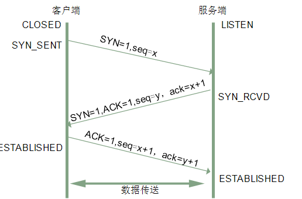
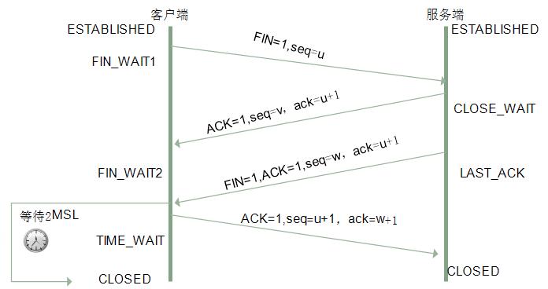
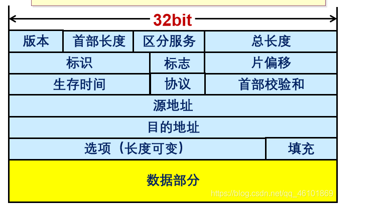
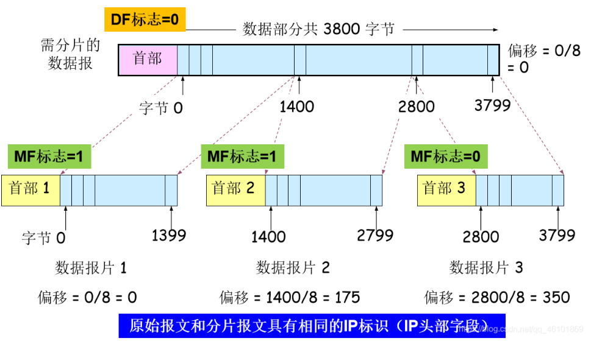
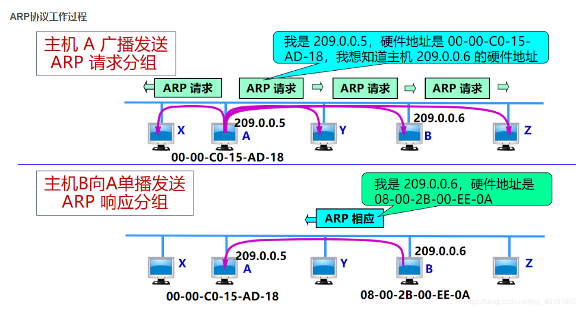

### 安全基础

###### 常见端口及对应的服务（TCP端口）

- **20/21** - FTP（文件传输协议）：21用于控制（命令），20用于数据传输。
- **22** - SSH（安全外壳协议）：用于安全地访问远程计算机。
- **23** - Telnet：一种不安全的远程终端协议，现在大多被SSH替代。
- **25** - SMTP（简单邮件传输协议）：用于发送电子邮件。
- **53** - DNS（域名系统）：用于将域名转换为IP地址。
- **80** - HTTP（超文本传输协议）：用于传输Web页面。
- **110** - POP3（邮局协议版本3）：用于电子邮件客户端从服务器接收邮件。
- **143** - IMAP（互联网消息访问协议）：用于访问和管理电子邮件，比POP3更先进。
- **443** - HTTPS（超文本传输协议安全）：HTTP的安全版本，用于安全传输Web页面。
- **3306** - MySQL：用于MySQL数据库服务。
- **3389** - RDP（远程桌面协议）：用于Windows远程桌面服务。
- **5432** - PostgreSQL：用于PostgreSQL数据库服务。
- **6379** - Redis：用于Redis键值存储数据库服务。

###### ARP欺骗原理：攻击者伪造ARP应答包，之后的数据都给攻击者发了。

###### SYN洪范攻击原理见下面TCP

###### 什么是同源策略

同源策略限制不同源对当前 document 的属性内容进行读取或设置。不同源的区分:协议、域名、子域名、IP、端口，以上有不同时即不同源。（后端）

###### TCP 和 UDP 协议区别

tcp 面向连接;udp面向报文

tcp 对系统资源的要求多; udp 结构简单

tcp 保证数据完整性和顺序; udp 不保证

###### 什么是中间人

中间人攻击是一个 (缺乏)相互认证的攻击;由于客户端与服务器之间在 SSL握手的过程中缺乏相互认证而造成的漏洞。

###### SSL

SSL代表安全套接字层。它是一种用于加密和验证应用程序(如浏览器)和 Web服务器之间发送的数据的协议。加密 Https 的加密机制是一种共享密钥加密和公开密钥加密并用的混合加密机制。

SSL/TLS 协议作用: 认证用户和服务，加密数据，维护数据的完整性的应用层协议加密和解密需要两个不同的密钥，故被称为非对称加密;加密和解密都使用同一个密钥的对称加密。

优点在于加密、解密效率通常比较高 HTTPS 是基于非对称加密的，公钥是公开的

1)客户端向服务器端发起SSL连接请求

2) 服务器把公钥发送给客户端，并且服务器端保存着唯一的私钥

3)客户端用公钥对双方通信的对称秘进行加密，并发送给服务器端4)服务器利用自己唯一的私钥对客户端发来的对称秘钥进行解密

5)进行数据传输，服务器和客户端双方用公有的相同的对称秘钥对数据进行加密解密，可以保证在数据收发过程中的安全，即是第三方获得数据包，也无法对其进行加密，解密和篡改。

因为数字签名、摘要是证书防伪非常关键的武器。“摘要”就是对传输的内容,通过 hash 算法计算出一段固定长度的串。然后，在通过 CA 的私钥对这段摘要进行加密，加密后得到的结果就是”数字签名”。SSL/TLS协议的基本思路是采用公钥加密法，也就是说，客户端先向服务器端索要公钥，然后用公钥加密信息，服务器收到密文后，用自己的私钥解密。

###### GET和post的区别

1)GET是获取数据;POST 是修改数据

2)GET 把请求的数据放在 url 上，以?分割 URL和传输数据，参数之间以&相连所以GET 不太安全;而POST 把数据放在 HTTP 的包体内 (request body)3)GET 提交的数据最大是2k (限制实际上取决于浏览器);POST 理论上没有限制。

4)GET 产生一个TCP 数据包，浏览器会把http header 和data一并发送出去服务器响应200(返回数据);POST 产生两个TCP 数据包，浏览器先发送 header.服务器响应 100 continue，浏览器再发送data，服务器响应200ok(返回数据)5) GET 请求会被浏览器主动缓存;而 POST 不会，除非手动设置。

###### DDOS攻击

DDoS攻击（Distributed Denial of Service attack，分布式拒绝服务攻击）是一种常见的网络攻击方式，旨在通过向目标发送大量请求或数据包来使网络服务不可用。这种攻击通常涉及多个攻击源，这些攻击源分散在不同的地理位置，它们协同工作以对目标网站或网络资源产生压倒性的流量，导致正常用户无法访问。

常见攻击：**UDP Flood、**SYN Flood、**ICMP (Ping) Flood、**DNS Amplification********

### web安全漏洞

#### SQL注入

##### 原理

SQL注入是指Web应用程序对用户输入数据的**合法性没有判断**，前端传入后端的参数是攻击者可控的，并且参数被带入数据库查询，攻击者可以通过构造不同的SQL语句来实现对数据库的任意操作。

满足两个条件：

* 参数用户可控：前端传给后端的内容是用户可以修改的。
* 参数被带入数据库中查询：传入的参数被拼接到SQL语句中，并带入数据库中查询。

##### 分类

报错注入：攻击者通过故意提交会触发数据库错误的SQL查询，**从而获取数据库的信息**。数据库在返回错误信息时可能会泄露数据库结构或敏感数据。

盲注：在盲注攻击中，攻击者无法直接看到查询的结果，数据库不会显示错误信息，因此攻击者需要通过发送一系列查询并观察应用程序的响应或行为来推断数据。

union注入：它允许攻击者将一个额外的SELECT查询添加到原始查询中，结果将合并两个查询的结果，并返回给用户

##### 危害

绕过登录验证，比如说使用万能密码登录网站;获取网站管理员账号密码;读取文件、写入 webshell等。

##### 防护方法

1)使用安全的API

2)对输入的特殊字符进行 Escape 转义处理

3)使用白名单来规范化输入验证方法

4)对客户端输入进行控制，不允许输入 SQL注入相关的特殊字符

5)服务器端在提交数据库进行 SQL查询之前，对特殊字符进行过滤、转义、替换，删除

6)规范编码，字符集

#### XSS（跨站脚本）漏洞

跨站脚本攻击（Cross-Site Scripting，简称XSS）是一种常见的网络安全漏洞，它允许攻击者将恶意脚本注入到正常用户会查看的网页中。这些恶意脚本在用户的浏览器中执行时，可以窃取cookie、会话令牌，劫持用户会话，重定向到恶意网站，甚至在受害者的浏览器中执行恶意操作。

##### 分类

1. **存储型XSS（Persistent XSS）** ：黑客将恶意JavaScript 脚本长期保存在服务端数据库中，用户一旦访问相关页面数据，恶意脚本就会被执行。常见于搜索、微博社区贴吧评论等。
2. **反射型XSS（Reflected XSS）** ：恶意脚本不是存储在服务器上，而是通过**URL参数**等方式直接反射给用户，用户访问带有恶意脚本的链接时，脚本随即在用户浏览器上执行。这通常需要诱使用户点击恶意链接。恶意 JavaScript 脚本属于用户发送给网站请求中的一部分，随后网站又将这部分返回给用户，恶意脚本在页面中被执行。一般发生在前后端一体的应用中，服务端逻辑会改变最终的网页代码。
3. **基于DOM的XSS（DOM-based XSS）** ：这种攻击不需要经过服务器，网页本身的JavaScript 也是可以改变 HTML的，黑客正是利用这一点来实现插入恶意脚本。

##### 危害

盗取用户 Cookie、未授权操作、修改 DOM、刷浮窗广告、发动XSS 虫攻击劫持用户行为，进一步渗透内网。

##### 防护

1)将HTML元素内容、属性以及URL 请求参数、CSS 值进行编码

2)当编码影响业务时，使用白名单规则进行检测和过滤

3) 使用 W3C 提出的 CSP(Content Security Policy，内容安全策略)，定义域名

白名单

4)设置 Cookie 的 HttpOnly 属性

#### CSRF漏洞

CSRF 英文全称是 Cross-site request forgery，又称为“跨站请求伪造”，就是黑客引诱用户打开黑客的网站，利用用户的登陆状态发起跨站请求。降维解释: **攻击者诱导受害者进入第三方网站，在第三方网站中，向被攻击网站发送跨站请求。利用受害者在被攻击网站已经获取的注册凭证，绕过后台的用户验证，达到冒充用户对被攻击的网站执行某项操作的目的.**

CSRF是跨站请求伪造攻击，由客户端发起。

#### SSRF漏洞

服务器端请求伪造（Server-Side Request Forgery，简称SSRF）是一种网络安全漏洞。在这种攻击中，攻击者能够迫使服务器端的应用程序对攻击者指定的内部或外部网络进行HTTP请求。通过利用这种漏洞，攻击者可以从服务器端应用程序的视角发送请求，这可能会导致未授权的数据访问或与内部系统的交互，绕过防火墙，访问内部服务，甚至执行远程代码。

是服务器端请求伪造，由服务器发起。

#### 文件上传漏洞

由于程序员在对用户文件上传部分的控制不足或者处理缺陷,而导致用户可以越过其本身权限向服务器上传可执行的动态脚本文件

##### 分类

###### 前端JS验证绕过

某些应用程序依赖于客户端JavaScript来验证上传文件。攻击者可以通过禁用JavaScript或使用自动化工具绕过这些验证，例如burp抓包再改文件名。

###### 无限制文件上传

应用程序允许用户上传任何类型的文件，没有对上传文件的类型、大小或内容进行足够的验证，攻击者可以上传恶意脚本（如PHP、JavaScript文件）或可执行文件。

###### MIME类型混淆（文件类型绕过）

攻击者通过更改HTTP头中的 `Content-Type`属性或文件扩展名，试图欺骗服务器接受一个恶意文件。例如，一个以 `.jpg`结尾的文件实际上可能是一个PHP脚本。

###### 路径截断绕过(00截断)、中间件解析漏洞、条件竞争、二次染、编辑器漏洞

##### 防御方法

上传目录的用户执行权限全部取消、判断文件类型、使用随机数改写文件名和文件路径、网站服务器和文件服务器分离、白名单检查、限制文件大小。

#### owasp漏洞都有哪些

OWASP（开放式Web应用安全项目）是一个专注于改进软件安全的国际性非盈利组织。OWASP定期发布一系列关于Web应用安全的文档，其中最著名的是OWASP Top 10。OWASP Top 10列出了当前Web应用中最常见和最危险的安全漏洞。截至我的最后更新（2023年4月），最新的OWASP Top 10列表是2021年版本，列出的漏洞如下：

1. **A1:2021 - Broken Access Control (访问控制缺失)**：攻击者可以绕过访问控制，以未授权的方式访问、修改或删除数据。
2. **A2:2021 - Cryptographic Failures (加密失败)**：以前称为“敏感数据泄露”，指的是对敏感数据的保护不当，如使用弱加密算法或配置不当，导致数据泄露。
3. **A3:2021 - Injection (注入攻击)**：包括SQL注入、命令行注入、LDAP注入等，攻击者通过注入恶意数据影响解释器执行非预期命令。
4. **A4:2021 - Insecure Design (设计不安全)**：与实现缺陷不同，这关注于从设计层面缺乏足够的安全控制措施。
5. **A5:2021 - Security Misconfiguration (安全配置错误)**：系统配置错误，如未配置的权限、暴露的敏感信息、未更新的软件等，是最常见的安全问题。
6. **A6:2021 - Vulnerable and Outdated Components (使用含有漏洞的组件)**：使用含有已知漏洞的组件，如库、框架、其他软件模块。
7. **A7:2021 - Identification and Authentication Failures (身份验证失败)**：身份验证和会话管理的实现不当，可能允许攻击者窃取密码、密钥或令牌。
8. **A8:2021 - Software and Data Integrity Failures (软件和数据完整性失败)**：未经验证的软件更新、危险的数据反序列化等，可能导致未授权的信息修改或恶意代码执行。
9. **A9:2021 - Security Logging and Monitoring Failures (安全日志和监控失败)**：缺乏足够的日志记录和监控，使得安全事件的检测、调查和响应变得困难。
10. **A10:2021 - Server-Side Request Forgery (SSRF) (服务器端请求伪造)**：攻击者可以迫使服务器向攻击者指定的内部或外部网络发送HTTP请求。

### 渗透测试相关

##### 什么是渗透测试（ **Penetration Testing** ）？

渗透测试（Penetration Testing）是关于安全测试的，它有助于识别**系统中的漏洞**。渗透测试是试图通过**手动或自动技术来评估系统的安全性**，以及如果发现任何漏洞测试人员使用该漏洞来更深入地访问系统并发现更多漏洞。此测试的主要目的是防止系统受到任何可能的攻击。

渗透测试可以通过两种方式进行——**白盒测试和黑盒测试**。

在白盒测试中，测试人员可以使用所有信息，而在黑盒测试中，测试人员没有任何信息，他们在真实场景中测试系统以找出漏洞。

##### 拿到一个待检测的站，你觉得应该先做什么

###### 信息收集

1)获取域名的 whois 信息获取注册者邮箱姓名电话等，丢社工库里看看有没有泄露密码，然后尝试用泄露的密码进行登录后台。用邮箱做关键词进行丢进搜索引擎。利用搜索到的关联信息找出其他邮箱进而得到常用社交账号。社工找出社交账号，里面或许会找出管理员设置密码的习惯。利用已有信息生成专用字典。2)查询服务器旁站以及子域名站点，因为主站一般比较难，所以先看看旁站有没有通用性的 cms 或者其他漏洞

3)查看服务器操作系统版本，web 中间件，看看是否存在已知的漏洞，比如IISAPACHENGINX的解析漏洞。

4)查看IP，进行IP地址端口扫描，对响应的端口进行漏洞探测，比如 rsync.心脏滴血，mysql,ftp,ssh 弱口令等

5)扫描网站目录结构，看看是否可以遍历目录，或者敏感文件泄漏，比如 php探针。

6)google hack 进一步探测网站的信息，后台，敏感文件。

###### 漏洞扫描

开始检测漏洞，如XSS,CSRF,sql 注入，代码执行，命令执行，越权访问，目录读取，任意文件读取，下载，文件包含，远程命令执行，弱口令，上传，编辑器漏洞，暴力破解等。

###### **漏洞利用**

利用以上的方式拿到 webshell，或者其他权限。

###### **权限提升**

提权服务器，比如 windows下 mysl的 udf 提权，serv-u 提权，windows 低版本的漏洞，如 [is6.pr](https://link.zhihu.com/?target=http%3A//is6.pr/),巴西烤肉，linux 脏牛漏洞，linux 内核版本漏洞提权，linux下的 mysal system 提权以及 oracle 低权限提权。

###### **日志清理**

总结报告及修复方案

###### 渗透测试中常见的端口

1）web 类(web 漏洞/敏感目录)第三方通用组件漏洞 struts thinkphp jbossganglia Zabbix: 80 web、80-89 web、8000-9090 web

2) 数据库类(扫描弱口令): 1433 MSSQL、1521 0racle、330 MySQL、5432PostgreSQL

3)特殊服务类(未授权/命令执行类/漏洞):443SSL心脏滴血873 Rsync未授权5984 CouchDB [http://xxx5984/_utils/、6379](https://link.zhihu.com/?target=http%3A//xxx5984/_utils/%25E3%2580%25816379) redis 未授权、7001,7002 WebLogic默认弱口令，反序列、9200,9300 elasticsearch 参考 WooYun: 多玩某服务器ElasticSearch 命令执行漏洞、11211 memcache 未授权访问、27017,27018Mongodb 未授权访问、50000 SAP 命令执行、50070.50030 hadoop 默认端口未授权访问

4)常用端口类(扫描弱口令/端口爆破):21ftp22 SSH、23 Telnet2601,2604 zebra路由，默认密码zebra、3389 远程桌面

### TCP连接

#### 三次握手问题（建立连接）

##### 三次握手

1. 客户端发送第一个SYN报文，SYN=1，此时序列号seq=x（告诉服务端我的数据从x开始）
2. 服务器收到客户端的 SYN 报文之后，回复一个确认报文，其中SYN=1，ACK=1，ack=x+1（知道你从x开始了），seq=y（告诉服务端我从y开始）
3. 客户端收到服务器的SYN后，回复一个ACK报文，ACK=1，seq=x+1(x开始，x+1就是正式的数据了)，ack=y+1（知道你从y开始了）

##### 为什么需要三次握手，两次不行

第一次握手：客户端的发送能力、服务端的接收能力是正常的。

第二次：服务端的接收、发送能力，客户端的接收、发送能力是正常的。**不过此时服务器并不能确认客户端的接收能力是否正常。**

**需要三次握手才能确认双方的接收与发送能力是否正常。**

##### 三次握手过程中可以携带数据吗？

其实第三次握手的时候，是可以携带数据的。但是，**第一次、第二次握手不可以携带数据，因为第三次时客户端知道双方都已经ok了，所有可以在seq那开始正常发数据了。**

##### SYN攻击是什么？

攻击者换不同的IP发送一次握手的SYN包，大量处于半连接队列，占据浪费服务器大量的资源。

#### 四次挥手（释放连接）

建立一个连接需要三次握手，而终止一个连接要经过四次挥手（也有将四次挥手叫做四次握手的）。这由TCP的 **半关闭** （half-close）造成的。所谓的半关闭，其实就是TCP提供了连接的一端在结束它的发送后还能接收来自另一端数据的能力。

第一次挥手：客户端发送FIN=1，seq=u（我从u开始发），停止再发送数据。

第二次挥手：服务端收到FIN了，不着急结束，先确认收到，回复ACK=1，seq=v（我从v开始发），ack=u+1（知道u开始了）。

第三次挥手：如果服务端也想断开连接了，回复FIN报文（FIN=1，ACK=1，seq=w，ack=u+1）

第四次挥手：客户端收到 FIN 之后，一样发送一个 ACK 报文作为应答（ACK=1，seq=u+1，ack=w+1），当服务端收到ACK后关闭连接；**服务端要等待2MSL才关闭**。

##### 挥手为什么需要四次？

此时服务端可能还没发完数据，先告诉客户端我知道你要结束了，你等会我发完先再确认。

##### 2MSL等待状态

**MSL**是Maximum Segment Lifetime的英文缩写，可译为“最长报文段寿命”，它是任何报文在网络上存在的最长时间，超过这个时间报文将被丢弃。

理论上，四个报文都发送完毕，就可以直接进入CLOSE状态了，但是可能网络是不可靠的，有可能客户端的最后一个ACK丢失，此时服务端超时重传一个FIN过来，而这个2msl就是用来等超时重传的，如果2msl里不再收到ACk，说明服务端关了，客户端也可以关了。但如果不等2msl自己先关了，人家可能一直在重传。

### IP协议

**MTU最大传输单元等于1400字节**

#### ip地址

#### 子网划分

#### CIDR   IP/前缀为网络号

#### ARP协议，根据IP找MAC

